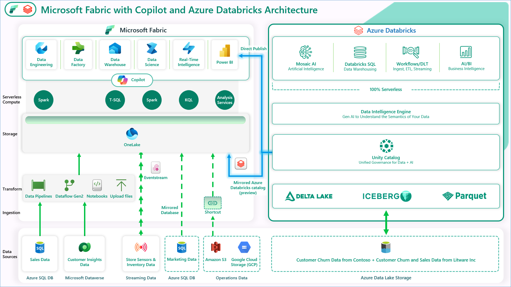

# Modernize-Your-Data-Estate-with-Microsoft-Fabric-and-Azure-Databricks

This lab showcases Microsoft Fabric with Copilot and Azure Databricks, featuring a cost-effective, performance-optimized, and Cloud-native analytics solution pattern. This architecture unifies our customers' data estate to accelerate data value creation.
 
The visual illustrates the real-world example for Contoso, a fictitious company. 

Contoso is a retailer with thousands of brick-and-mortar stores across the world and an online store. Contoso is acquiring Litware Inc., which has curated marketing data and sales data processed by Azure Databricks and stored in the gold layer in ADLS Gen2. Contoso also has their customer churn data stored in the gold layer in ADLS Gen2. 
 
In the following exercises, you will see how the Contoso team leveraged the power of Microsoft Fabric to ingest data from a spectrum of sources, combine Litware's data with their existing data from ADLS Gen2, and derive meaningful insights. Explore how they used a shortcut to reference Litware’s existing data from ADLS Gen2. Finally, you will see how Contoso’s data architects utilized Unity Catalog to quickly get up to speed on the acquired company’s data. You will also see the power of creating LLM Chatbots with the Databricks Data Intelligence Platform to achieve an unprecedented market sentiment for Contoso.

The lab scenario begins on January 30th. The new CEO, April, has noticed some negative trends in the company’s key metrics, including:

- A high number of their customers leaving

- Falling sales revenue

- High bounce rate on their website

- High operating costs

- Poor customer experience

- And most importantly, low market sentiment

To address the high customer churn, April and the Contoso team decided to acquire Litware Inc., which carries products popular with millennials. April asks Rupesh, the Chief Data Officer, how they could create a data-driven organization and reverse these adverse KPI trends. Rupesh talks to his technical team, including Eva, the data engineer; Miguel, the data scientist; and Wendy, the business analyst. He tasks them with designing and implementing a solution pattern to realize this vision of a data-driven organization. 

The team recognizes that the existence of data silos within Contoso's various departments presents a significant integration challenge, which is intensified by the need to combine subsidiary data with data from Litware Inc. To overcome these challenges, they plan to utilize Fast Copy for efficient data ingestion, Task Flow for streamlined workflows, Real-time Intelligence for immediate insights, and Azure SQL DB Mirroring in Microsoft Fabric to ensure seamless access to relational data across the organization.

During this lab you will execute some of these steps as a part of this team to reverse these adverse KPI trends. First, you will ingest data from a spectrum of data sources into OneLake for Contoso. Let's get started.
